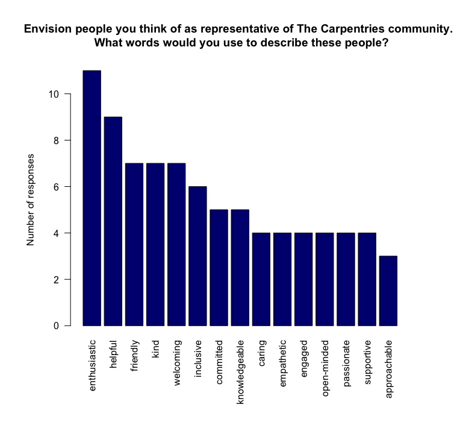
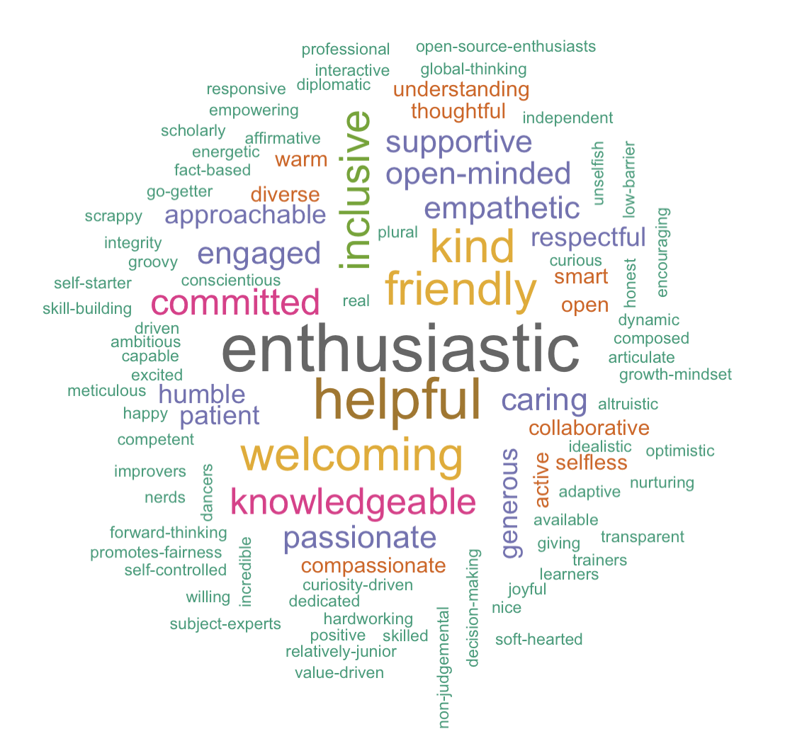

## Acknowledgement

A big thank you to The Carpentries community, who are the embodiment of these values outlined above, and who responded to our call for input, providing invaluable insight and elaborate recommendations that made it possible for us to pinpoint these nine values for The Carpentries.

We are also indebted to The Carpentries team and Executive Council for interrogating our process, reviewing our progress, editing our content and keeping the Task Force accountable for the duration of this project.

This project came together thanks to the tireless efforts of  Amy Hodge from The Executive Council, Dr. Kari L. Jordan and Tracy Teal who served with me on the Values Project Task Force in Q3 and Q4 2019.

We are also grateful to Lou Woodley,  Director of the [Center for Scientific Collaboration and Community Engagement](https://www.cscce.org), whose expertise and resources provided guidance as we worked on this project.

## Why we set out to do this work 

Shared values and goals have long been the starting point of communities of practice as they identify changes they want to see and start working together towards these changes. The Carpentries started out with a clear goal - teaching foundational computational skills to researchers worldwide. Something that is also important and unique about our community is how we work and engage with each other. As a community, values are important to us and we consider that we have a set of shared values. However, we have not yet articulated what these values are.

[The Carpentries Executive Council](https://carpentries.org/governance) did some preliminary work on this at their in-person meeting in 2018, and [The Carpentries team](https://carpentries.org/team/) also did some initial exercises in January 2019 in this regard.

To be truly reflective of the community however, we believe that it is important for community involvement to be an integral part of creating these value statements. For this reason, we asked The Carpentries community three questions, collected feedback in three different places.  We intended to use this information to inform and create a first set of value statements for The Carpentries.

## How we carried out this work

The Carpentries team started by drafting a project plan - stating why this work was important, what the aims and scope of the project would be. 
We also brainstormed on different approaches to this work, and determined what resources we would need to exemplify The Carpentries’ collaboration-driven ethos through this project.
We then created our four-person Task Force comprised of

1. Amy Hodge, 2019 Chair of the Executive Council, 
1. Tracy Teal, Executive Director in The Carpentries, 
1. Dr. Kari L. Jordan, Senior Director of Equity and Assessment in The Carpentries and with 
1. Serah Rono, Community Engagement Lead in The Carpentries as lead on this project.

The Task Force’s first task was to draft broad questions that would allow our community to reflect on their experiences and interactions in The Carpentries, and share these, together with their thoughts and ideas with us. After a period of question drafting, we came up with three:

1. Envision people you think of as representative of The Carpentries community. What words would you use to describe these people? (No need to identify them, briefly outline their characteristics.)
1. The workshops we run, calls we hold, interactions we have on various platforms, and guidelines we use to uphold these interactions are but a few things that make us who we are as a community. With this in mind, in 2-3 sentences, how would you describe The Carpentries community culture?
1. From your understanding of our community culture and the demeanour of individuals that constitute The Carpentries, what specific actions would you like The Carpentries community to take up or uphold in everyday Carpentries conversations going forwards?

Based on feedback from the communications strategy project, The Task Force determined that it would be best to provide the community with multiple options to share feedback. We chose [our conversations GitHub issue tracker](https://github.com/carpentries/conversations/issues/21), a [Google form](https://forms.gle/gZmafyLVKAHBqfgc6) that allowed for anonymous responses, and via [our community Discuss forum](https://carpentries.topicbox.com/groups/discuss/T9029fc4692993ab1/input-needed-help-us-articulate-the-carpentries-values).

The Task Force then enlisted help from The Carpentries team in reaching out to our global Carpentries community to get as much feedback as possible. The team mentioned this project to community members in emails, on community calls and at conferences and other events. Our community joined the bandwagon and amplified our questions on various social platforms for the eight weeks we sought feedback.

In October 2019, at the start of Q4,  the Task Force started reviewing all input from our community, and The Carpentries team who had carried out a values project exercise at their in-person meeting in January 2019. 

To remain objective, we first reviewed input individually, and listed key themes that stood out, with bullet points under each one. We then compared notes and narrowed our choice themes to the top 10 and summarised bullet points under each one as short statements.

During the iteration process in October, we realised that the key themes touched on 

1. what we do, 
    The first three value statements reflect this. 
     **At the Carpentries, we...**
    
1. our demeanour,
    The next two value statements expound on our attitude and approach to all that we do in The Carpentries. 
     **We are...**

1. And what we uphold.
    The final set of four value statements elaborate on what we boldly stand and advocate for. 
     **We champion…**

Finally, we presented our first draft of the nine value statements to The Carpentries team and Executive Council, and spent two weeks in November incorporating their edits and feedback, and drafting this report, and the blog post to announce our first set of value statements to The Carpentries community.

## What we heard you say and learnt from you

### Question 1

_bar chart above and word cloud below summarising responses to question 1 of The Carpentries Values project_

### Question 2

We also asked you to tell us what you make of The Carpentries community culture. Many of the responses to this second question expounded on positive feedback shared under question one. Among other things, respondents made mention of 

- a ‘people-first’ approach to all things community in The Carpentries,
- a deep-seated interest for knowledge acquisition and exchange, 
- timely support for learners and instructors in and beyond Carpentries workshops, and
- the cultural diversity 
as some of the notable aspects of our community culture.

We especially appreciated that this second question allowed room for candour, as community members  highlighted areas The Carpentries community can improve on. Here are a few things we heard from you:

- Welcoming, and seeking to improve. Inspiring and willing to share. Sometimes too excitable about new things when time should be spent fixing long-running problems.
- Enthusiastic and helpful, keen to assist. It's still intimidating though!
- The community is supportive, inclusive and welcoming but can occasionally seem a little rigid.

### Question 3

Having heard about your perceptions of our community in response to questions 1 and 2, we asked you to share specific actions you’d like to see our community take up or continue with in everyday Carpentries interactions going forwards. 

Here’s a brief summary of your responses:

#### Start doing

- Acknowledging our community members/leaders more often.
- Providing clear pathways for off-boarding community members/leaders from major responsibilities 
- Show a continuing commitment to creating and supporting structures that support the community and communications will be important. 

#### Continue doing

- Requests for Comments (RFCs)! We should definitely continue to get community feedback on major initiatives and offerings before they’re launched.
- Communicating on multiple channels. We have to continue sending out our messages on multiple platforms, especially until we have regional coordinators in all of our major regions.
- The Carpentries is good at welcoming new people! Show how we can support them through growth in the Carpentries community

## Our values, what are they?

**At The Carpentries we..**

#### Act Openly

We believe that transparency, honesty, and fairness are keys to fostering trust within an open community. 

#### Empower One Another

We help people build knowledge by creating a conducive environment for the exchange of skills, perspectives and experiences that empower people and enable them to reach their potential.

#### Value All Contributions

We value all contributions by individuals and entities to our community, code, lessons and broader ecosystem that adhere to The Carpentries Code of Conduct.

**We are..**

#### Always Learning

We value a growth mindset in all that we do and strive for continuous improvement, evolving ourselves and our methodologies, being receptive to feedback, responsive, curious, and eager to learn. 

#### Inclusive of All

We advocate for inclusivity - welcoming and extending empathy and kindness -  to leverage contributions from all community members, regardless of their identity or expression.

**We champion...**

#### People First

We believe that the individuals who make up our community are the most important part of our organisation and our strongest resource. We strive to make decisions that lower barriers for individual participation.

#### Access for All

We value accessibility as core, and create multiple avenues for participation where all people can learn and contribute.

#### Community Collaboration

Our curricula and programs are developed by and with community members. We see collaboration across borders, domains and initiatives as a pathway to empower people and realise shared goals.

#### Strength through Diversity

Appreciating that identities are complex and individual, we believe in empowering a diverse group of people to work with data and code to answer the questions important to them and address challenges in science and society.

## What you can expect going forwards

As the final stop for this project, the Task Force is currently working [November / December 2019] to translate these recommendations into specific asks that will be shared with different teams and committees in The Carpentries for adoption and implementation as part of 2020 / 2021 work. 

